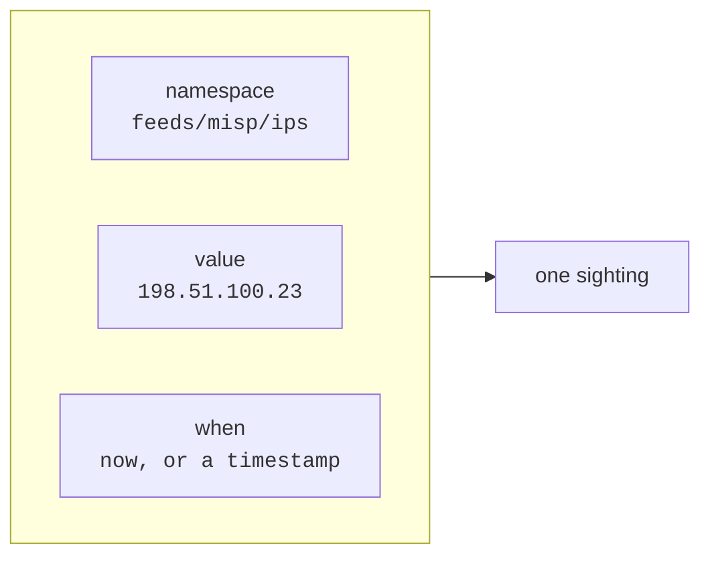
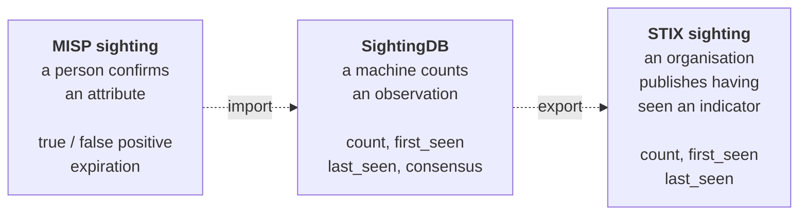
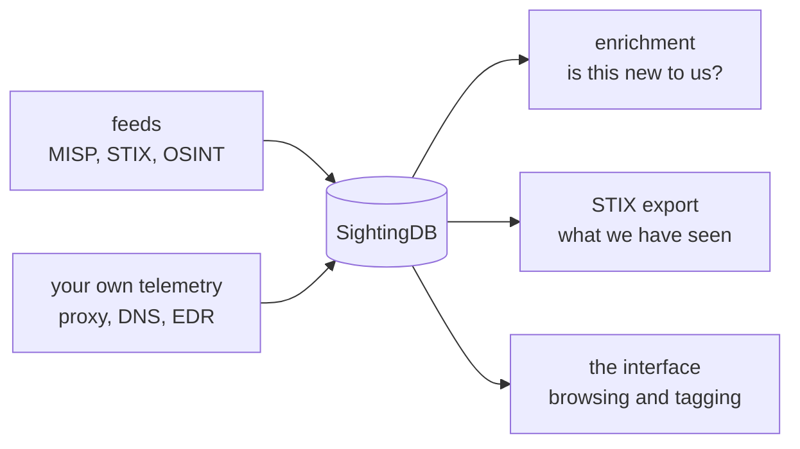

# What this is

A sightings database answers one question: **how often have you seen this, and
when?**

Not whether it is malicious. Not who owns it. Not what campaign it belongs to.
Those are judgements, and there are good tools for keeping judgements. This
keeps the observations the judgements are made from — and it keeps them at a
volume and a speed that makes the count itself worth reading.

That is the whole idea. An address seen once last March is a different thing
from an address seen four thousand times this morning, and from an address seen
once a day for eighty days. Nothing about the address changed. What changed is
what you know about it, and all you needed to know it was a counter.

## What a sighting is

A sighting is a value, in a namespace, at a moment:



Write the same value again and the count goes up. That is the entire write
path, and it is why this is fast: there is no document to re-index and no
verdict to recompute.

What comes back when you read it:

| Field | Meaning |
| --- | --- |
| `count` | How many times this namespace has seen this value. |
| `first_seen`, `last_seen` | The ends of the window it has been seen in. |
| `tags` | What the value *is*, as a set — see chapter 6. |
| `ttl` | When it stops being visible, if ever. |
| `consensus` | How many namespaces have seen it at all. |
| `stats` | The count broken down by hour, on request. |

`consensus` is the one that is not obvious. It counts *namespaces*, not
sightings: a value seen a thousand times in one feed has a consensus of one,
and a value seen once each in six feeds has a consensus of six. The first is
noisy; the second is corroborated. They are different questions and they
deserve different numbers.

## Namespaces are paths

A namespace is a path, and it browses like folders:

```text
feeds/misp/ips
feeds/misp/domains
myorg/proxy/domains
watchlist/ips
```

There is no schema to declare. Writing to `feeds/misp/ips` creates it. The path
is yours to organise: by source, by type, by team, by sensitivity. What it buys
you is that access is granted by prefix — a key can be given `rw:feeds` and
reach everything under it and nothing else — and that storage is managed by
top-level namespace, so `feeds` can live in memory while `archive` lives on
disk.

## Sightings, elsewhere

The word is not ours, and it is worth knowing what the two standards that use
it mean by it, because SightingDB sits deliberately between them.

### MISP

MISP's definition is a person speaking:

> Sighting is a way for a user to say that they have seen or notice an
> attribute and confirm its validity.
>
> --- [MISP's documentation](https://www.circl.lu/doc/misp/sightings/)

A MISP sighting is therefore partly a **judgement**. There are three kinds — a
*true positive*, a *false positive*, and an *expiration date* saying an
attribute has stopped being relevant — and they feed MISP's scoring and
decaying models. An analyst saying "yes, we saw this, and it was real" is
exactly the signal those models need.

### STIX 2.1

STIX models a sighting as a relationship between an indicator and whoever saw
it. What distinguishes it from every other relationship is the three properties
it alone carries:

> Sighting contains unique properties like `count`, `first_seen`, and
> `last_seen` that convey when a SDO was seen within a particular timeframe as
> well as the number of times this SDO was seen.
>
> --- [OASIS, *Sighting of an Indicator*](https://oasis-open.github.io/cti-documentation/examples/sighting-of-an-indicator)

In the OASIS example, one organisation publishes an indicator for a malicious
URL and another, seeing it on their own network, publishes a sighting of it:

```json
{
  "type": "sighting",
  "spec_version": "2.1",
  "id": "sighting--ee20065d-2555-424f-ad9e-0f8428623c75",
  "count": 1,
  "first_seen": "2017-02-27T21:37:11.213Z",
  "last_seen": "2017-02-27T21:37:11.213Z",
  "sighting_of_ref": "indicator--9299f726-ce06-492e-8472-2b52ccb53191",
  "where_sighted_refs": ["identity--..."]
}
```

### Where this fits

Look again at what STIX says is special about a sighting — `count`,
`first_seen`, `last_seen` — and then at what SightingDB stores. They are the
same three fields. That is not a coincidence or a convenience: **this is a
database of exactly the thing a STIX sighting is**, which is why the export in
chapter 11 is a mapping rather than a translation.



The difference from MISP is the one worth holding on to. A MISP sighting is a
**judgement** made a few times by people; a SightingDB sighting is an
**observation** recorded continuously by machines, with no view on whether the
thing is good or bad. That is why there is no "false positive" here: nothing is
being asserted that could be false. The value was seen, four thousand times,
and what that means is yours to decide.

The two are complements rather than rivals. A MISP attribute whose decaying
model says it has gone stale, and a SightingDB count that says your proxy has
seen it eleven times this morning, are both true and interesting at once.

## What it is not

It is not a threat intelligence platform. It holds no verdicts, no
relationships, no cases, no workflow. It will happily tell you that you have
seen `198.51.100.23` four thousand times and take no view on whether that is
good or bad.

It is not a log store. A log line is an event with a shape; a sighting is a
counter with a window. If you need to answer "what happened at 14:32", keep
your logs. If you need to answer "is this the first time?", in the time it
takes to answer an API call, this is the thing.

It is not a graph. Values do not point at each other.

> Those are not gaps to be filled in later. They are the reason a write is a
> counter increment and a read is a map lookup, which is what makes the numbers
> above cheap enough to ask for on every event you process.

## Where it sits

Most deployments put it behind whatever is already producing observations —
a proxy log pipeline, a MISP feed, a sensor — and in front of whatever is
asking questions.



The rest of this book is how to run that, starting with the shortest possible
version of it.
