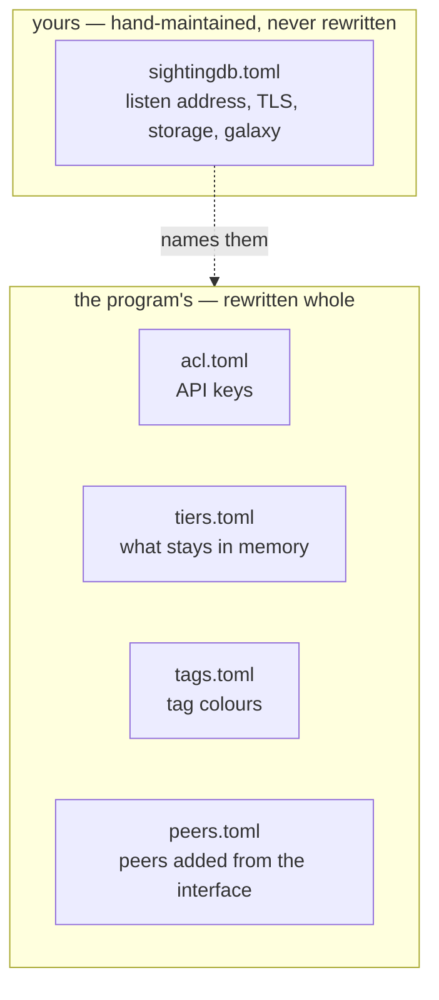

# Configuration

Everything is TOML, and there are five files. Knowing which of them is yours
and which belongs to the program is most of what there is to know.

## Yours, and the program's



`sightingdb.toml` is comment-rich and the program does not write to it. The
other four it rewrites, wholesale, whenever you change the matching thing in
the management interface.

That is why they are separate files. A program that rewrote the main
configuration would destroy the comments in it, and those comments are the
documentation you actually read at three in the morning. The cost is that
**anything set directly in `sightingdb.toml` is read-only in the interface** —
which it says, rather than appearing to accept a change that will not last.

If you do not name one of the four, the matching thing still works; it is
simply not editable. No `tags_file` means the standard colours and a Tags page
that says it cannot save. No `peers_file` means the peers in `[galaxy] peers`
and a Galaxy page that cannot add one.

## The minimum

```toml
[daemon]
listen_ip = "127.0.0.1"
listen_port = 9999
authenticate = true
ssl = false
dbdir = "/var/lib/sightingdb"
acl_file = "/var/lib/sightingdb/acl.toml"
```

That is a working server. Everything below has a default.

## `[daemon]`

| Setting | Default | What it does |
| --- | --- | --- |
| `enabled` | `true` | `false` runs DNS or ZMQ ingest with no HTTP API. |
| `listen_ip`, `listen_port` | `127.0.0.1:9999` | Where the API listens. |
| `authenticate` | `true` | `false` disables API keys entirely. For a laptop. |
| `daemonize` | `false` | Fork into the background. Leave off in a container. |
| `ssl`, `ssl_cert`, `ssl_key` | off | Terminate TLS here. |
| `dbdir` | none | Where snapshots live. **Without it nothing survives a restart.** |
| `snapshot_interval` | `300` | Seconds between writing the database out. |
| `sweep_interval` | `60` | Seconds between expiring TTLs and evicting cold shards. |
| `stats_retention` | `720` | Hourly buckets kept per value. 720 is 30 days. |
| `shadow_ttl` | `2592000` | How long a record of "somebody searched for this" lasts. |
| `post_limit` | 2.5 GB | The largest bulk request accepted. |
| `rejection_log` | `1000` | How many refused values to keep for the interface. |
| `node_id` | `"local"` | **This server's name in its own counters.** |
| `acl_file`, `tags_file` | none | The machine-owned files above. |
| `log_out`, `log_err` | stdout | Where the logs go. |

`node_id` is the one to get right before a server joins a galaxy. Sightings are
counted per node, so two servers sharing a name each take the other's
contributions for their own, and the merge that should reconcile them discards
one side instead. Give every server its own.

## `[storage]`

```toml
[storage]
default_tier = "hot"
warm_idle = 3600
tiers_file = "/var/lib/sightingdb/tiers.toml"
namespaces = ["feeds", "myorg"]
```

`namespaces` is what this server stores. Absent means everything. An empty list
makes it a router, which stores nothing of its own and forwards — see chapter
8. Prefixes match whole path segments, so `feeds` holds `feeds/misp/ips` and
never `feeds-internal`.

The three tiers decide what sits in memory:

| Tier | Behaviour |
| --- | --- |
| `hot` | Stays in memory. The default. |
| `warm` | Written out and dropped after `warm_idle` seconds untouched. |
| `cold` | Dropped at the next sweep. |

Evicted data is not gone — the shard is read back when it is next used, so
`cold` costs one load per burst of activity rather than one per operation.
Tiers apply to a whole top-level namespace, because that is one file paged in
and out as a unit.

## `[acl]`, or `acl_file`

```toml
[acl]
"changeme" = "rw, admin"
"analyst"  = "r"
"feed-misp" = "rw:feeds/misp"
"lb-to-us" = "rw:feeds"
```

A grant is `r`, `w` or `rw`, each optionally followed by `:<prefix>`, plus
`admin` for the management interface. Without a prefix the grant is global.
Access is allow-only: a key is denied unless one of its grants both covers the
namespace and carries the permission.

**Set `acl_file` instead** if you want the interface to manage keys. The two
together is an error worth avoiding: the file wins, and an `acl_file` that does
not exist yet starts *empty*, discarding an inline `[acl]` table. Use one or
the other.

Out-of-reach namespaces answer `404` rather than `403` throughout, so that
browsing cannot be used to enumerate what a key may not see.

## `[galaxy]`

The whole of chapter 8. In short:

```toml
[galaxy]
peers_file = "/var/lib/sightingdb/peers.toml"
max_hops = 4
health_interval = 30
sync_interval = 300
reconcile_interval = 3600
gossip_interval = 600
peers = [
  { url = "https://node-a.example:9999", key = "..." },
  { url = "https://node-b.example:9999", key = "...", namespaces = ["feeds"] },
  { url = "https://spare.example:9999", key = "...", enabled = false },
]
```

A peer carries the key **this** server authenticates to it with, which is the
bound on what it may do there, and what that peer holds, so a request can be
sent where it can be served.

## `[stix]`, `[zmq]`, `[dns]`

Three optional sections, each with a chapter or a section of its own:

- `[stix]` — who exports are published as, and which observable type a
  namespace holds by default. Chapter 11.
- `[zmq]` — subscribe to a MISP publisher and write what it sends. Chapter 11.
- `[dns]` — answer sightings over DNS, DNSBL-style, for tools that speak no
  HTTP. It **bypasses the ACL**, which is why its defaults are locked down.

## Changing it while it runs

| Change | Needs a restart? |
| --- | --- |
| API keys | No, if `acl_file` is set. |
| Storage tiers | No, if `tiers_file` is set. |
| Tag colours | No, if `tags_file` is set. |
| Galaxy peers | No, if `peers_file` is set. |
| Anything else | Yes. |

The last row is honest rather than apologetic: the listen address, TLS, the DNS
zone and the storage policy all need sockets rebound or the database rebuilt,
so "editable at runtime" would mean "applied at the next restart" anyway.
