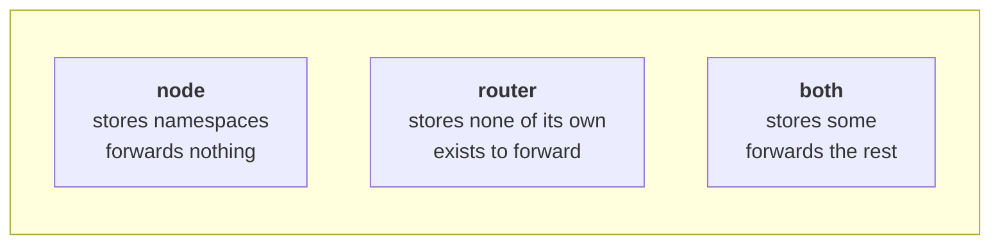
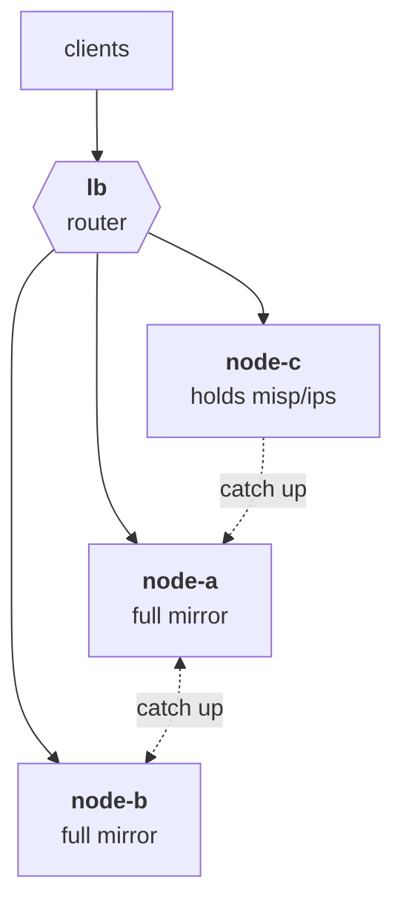
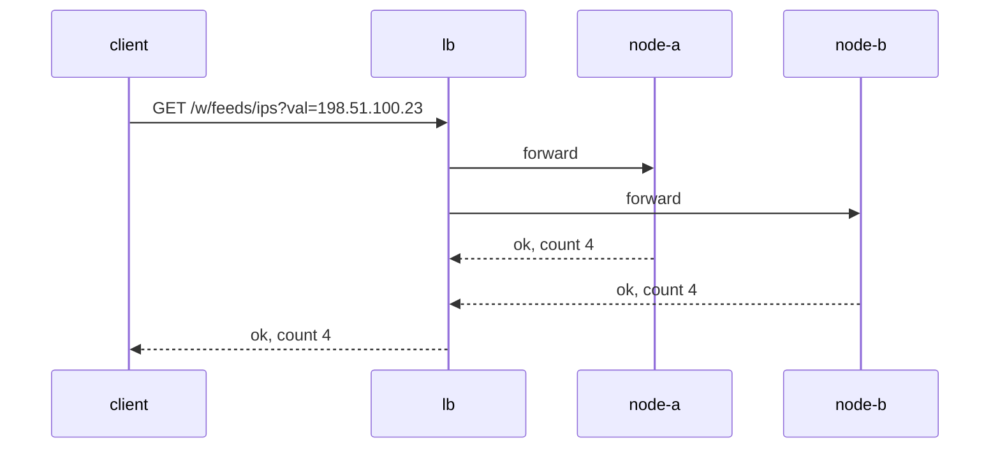
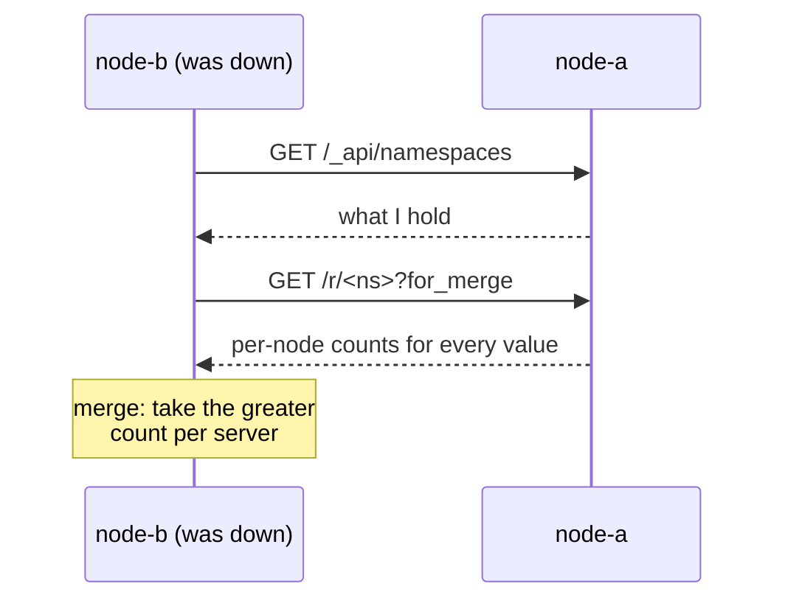
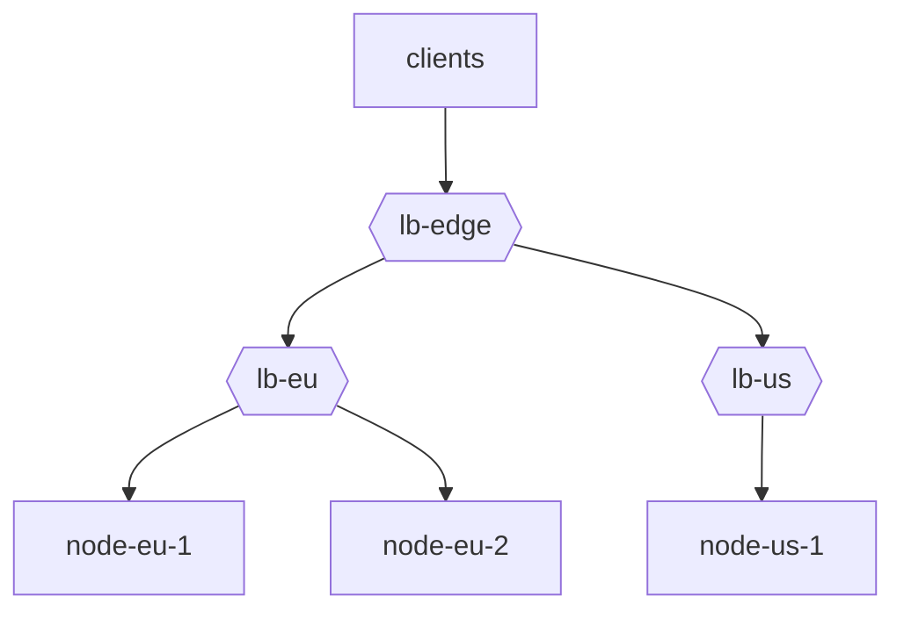

# Galaxies

One server is a *node*. Several servers that know about each other are a
*galaxy*. This chapter is what the pieces are; the next is running one.

## Why more than one

Two reasons, and they want different shapes.

**More clients than one server can answer.** Put a server in front that stores
nothing and forwards everything to mirrors behind it. Reads spread across the
mirrors; writes go to all of them.

**More data than one server should hold.** Give each node a slice of the
namespace tree. A node that holds only `feeds/misp` needs the disk for
`feeds/misp` and nothing else.

Both are the same mechanism.

## The three roles



They describe a *configuration*, not a type. Any server can be any of them, and
the only thing that decides which is `[storage] namespaces`:

| `namespaces` | Role |
| --- | --- |
| absent | A node that stores everything — a full mirror. |
| `["feeds", "myorg"]` | A node that stores those subtrees — a partial mirror. |
| `[]` | A router. Stores nothing of its own. |

Add `[galaxy] peers` and a node becomes "both": it keeps what it holds and
forwards what it does not.

## What a galaxy looks like



That is the sample in `doc/docker`. The load balancer is the entry point;
clients talk only to it. Each node declares what it holds, and the load
balancer is configured with the same declaration so it knows where a request
can be served.

## Forwarding

The rule is short:

- **A write goes to every live mirror** of its namespace.
- **A read goes to one**, chosen by hashing the value.



Writes must reach every mirror or the mirrors diverge. Reads must reach exactly
one, and always the *same* one for a given value, for a reason worth stating:
mirrors drift apart transiently while they catch up with each other, so two
consecutive reads served by different mirrors could show a count going **down**.

The choice is made by hashing the value against each mirror's address and
taking the highest — *rendezvous hashing*. Compared with picking a mirror by
`hash(value) % n`, it moves the fewest values when a mirror is added or
removed: mod-n reshuffles about 89% of values where 11% is the minimum. That
was measured rather than assumed; `doc/sharding-experiment.py` reproduces it.

## Counting, without inflating

Here is the problem that shapes everything else.

A write arrives at the load balancer and is forwarded to two mirrors. Each
records a sighting. Later the mirrors sync with each other. If each counted the
write as *its own*, the merge would add the two together and three writes would
become six — and six again at the next merge.

So **a sighting is counted per server**:

```json
{"counts": {"lb": 3}, "first_seen": ..., "last_seen": ...}
```

Both mirrors record `{"lb": 3}`, because the write is attributed to the entry
point the client actually reached and not to whichever mirror stored it.
Merging two copies takes the greater value for each server, so two mirrors that
already agree change nothing. The total you read is the sum.

That single decision is what makes every other piece safe: merges can be
retried, they can arrive in any order, and a mirror can be synced twice with no
effect.

> This is why `node_id` must be unique. Two servers sharing a name each take
> the other's contributions for their own, and the merge meant to reconcile
> them discards one side instead.

## Consensus across a galaxy

`consensus` — how many namespaces have seen a value — cannot be answered by any
single node, because no node has all the namespaces. The router keeps the tally
itself: when a mirror says a sighting was *new there*, the router counts it.

That number only ever rises on its own, because values expire and namespaces
are deleted on the nodes and neither reaches the router. So a router surveys
its galaxy on a timer and puts the tally right. It is a repair, not a steady
cost: the incremental tally answers reads in between.

## Catching up

A node that was down missed whatever was written while it was away. On a timer
it asks each peer what it holds, compares, and pulls what it is missing.



It only ever pulls namespaces it stores itself, so a partial mirror stays
partial.

While a node is catching up it says so, and **the router sends reads
elsewhere** until it is done — which is what makes a backfill invisible rather
than a window of wrong answers. Writes keep going to it throughout: they land
directly, and the catch-up fills in the history behind them.

## Cascades

A peer may itself be a router, so a galaxy can be a tree:



A forwarded request carries a hop count, spent at every hop and refused at
zero. That is what stops a miswired cycle — and a cycle matters more here than
usual, because a request going round one would inflate every count it carried.
A request that runs out of hops answers `508 Loop Detected`.

A cascade also **preserves the entry point**: a write forwarded twice is still
counted once, for the server the client actually reached.

## Keys are the boundary

Every peer entry carries the key *this* server authenticates to that peer with:

```toml
peers = [
  { url = "https://node-a:9999", key = "lb-full" },
  { url = "https://node-c:9999", key = "lb-ips", namespaces = ["misp/ips"] },
]
```

Those keys live in the **peers'** ACLs, and it is the peer that enforces them.
Give the load balancer `rw:misp/ips` on node-c and it cannot write anywhere
else there — however it is configured, and however it is compromised. That is
not a policy the load balancer applies to itself; it is a capability it does not
hold.

Give a peer key the narrowest grant that does the job, and never `admin`:
nothing in forwarding needs it.

> One consequence worth knowing: the galaxy *graph* asks each peer about its
> own peers, and that needs `admin` there. With narrow keys the graph draws
> this server's peers from its own configuration instead, labelled "as
> configured here". That is the right trade, not a bug.

## When nothing holds it

| Answer | Means |
| --- | --- |
| `404` | The namespace exists somewhere in reach, and the value is not in it. |
| `421` | **No server in reach stores that namespace at all.** |
| `502` | A mirror that holds it could not be reached. |
| `508` | The request ran out of hops. |

Three different answers, and only `502` is worth retrying. Collapsing them into
`404` — which is what an earlier version did — makes "the server that has it is
down" indistinguishable from "there is no such thing".
